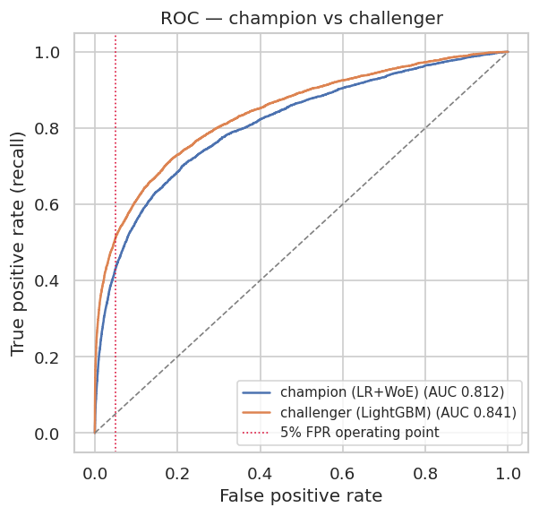
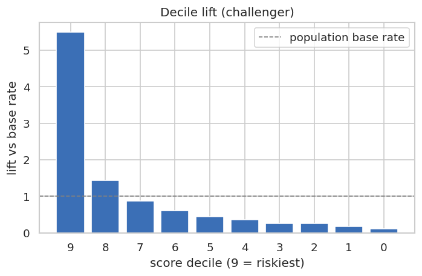
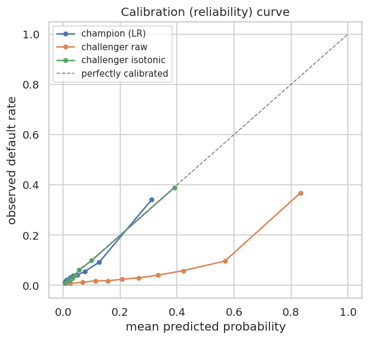
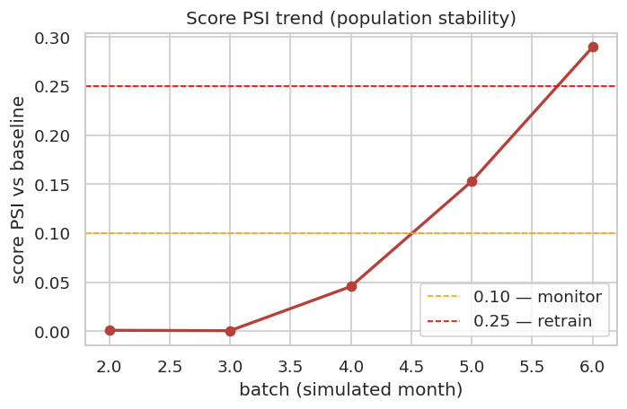
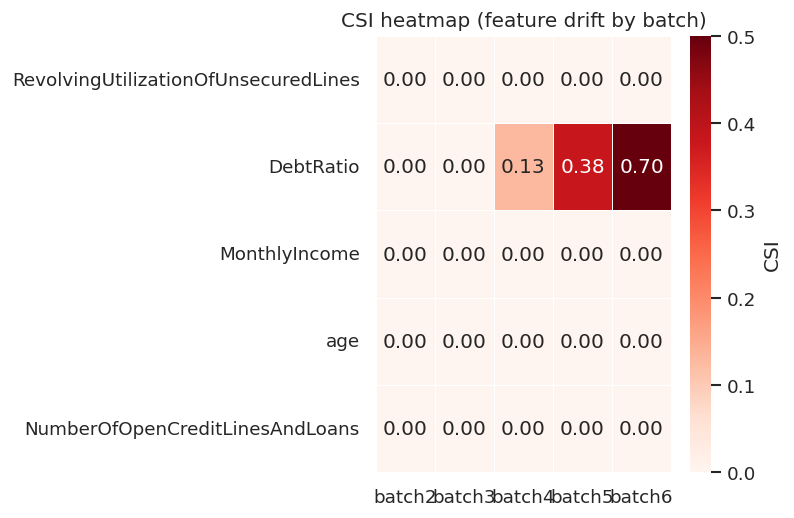

# Credit Scoring + PSI/CSI Monitoring + Champion-Challenger

End-to-end credit-risk model lifecycle on a *Give Me Some Credit*-schema dataset (~150k loans): train two models, frame the production swap as a **champion-challenger** decision with bootstrapped confidence, then **monitor** for post-deployment drift with PSI/CSI.

📓 **Notebook:** [`notebooks/credit-scoring.ipynb`](notebooks/credit-scoring.ipynb) (view on nbviewer — paste the GitHub URL into nbviewer.org) · 📄 **Decision readout:** [`outputs/readout.pdf`](outputs/readout.pdf)

---

## TL;DR

| | Champion (LR + WoE) | Challenger (LightGBM) |
|---|---|---|
| AUC (held-out) | **0.812** | **0.841** |
| KS | 0.489 | 0.533 |
| Gini | 0.624 | 0.683 |
| 5-fold CV AUC | 0.812 ± 0.009 | 0.842 ± 0.007 |

- **Decision @ 5% FPR:** **SHIP challenger** — catches **+8.1pp** more defaulters (recall 51.1% vs 43.0%; 95% CI **[6.9, 9.3]pp**, paired bootstrap).
- **Economics:** ~**408** extra defaulters caught, ~**$2.04M** loss avoided per window, at ~**$0** extra false-positive cost (equal FPR).
- **Monitoring:** PSI/CSI **detected the injected `DebtRatio` drift** (CSI 0.13→0.38→0.70 across batches 4–6, into the retrain band) while the `age` control stayed stable ✓.

## Key charts

| ROC | Decile lift | Calibration |
|---|---|---|
|  |  |  |

| Score PSI trend | CSI heatmap (drift detection) |
|---|---|
|  |  |

## Method

1. **Data & quirks** — handle ~6.7% imbalance, ~20% missing income, revolving/debt outliers, and the `96`/`98` past-due **sentinel codes** (validated, not accepted at face value).
2. **Prep** — train-only fit → test apply (no leakage); time-batch split (1–3 train, 4–6 test), not random.
3. **WoE / IV** — hand-rolled; drop IV<0.02, flag IV>0.5 (revolving utilisation reviewed and retained).
4. **Models** — LR on WoE (champion), LightGBM on raw (challenger); 5-fold CV refits WoE per fold.
5. **Evaluation** — AUC/KS/Gini/lift + isotonic-calibrated challenger (no accuracy on an imbalanced target).
6. **Decision** — recall at a fixed 5% FPR, paired bootstrap CI, pre-registered ship rule, money translation.
7. **Monitoring** — score PSI (alarm) + per-feature CSI (root cause), baseline-frozen bins, verified against injected drift.

## Reproduce

```bash
python3 setup_env.py                     # builds .ckenv via uv, installs deps
./.ckenv/bin/python build_pipeline.py    # data → models → charts → outputs/results.json
./.ckenv/bin/python build_readout_pdf.py # outputs/readout.pdf
```

Data is a synthetic GMSC-schema generator (`src/data_generator.py`) so the project runs without Kaggle credentials. Drop a real `data/cs-training.csv` in and it is used instead — the schema matches.

## Project layout

```
src/   data_generator · prep · woe · metrics · train · decision · psi · plots
build_pipeline.py · build_readout_pdf.py · notebooks/credit-scoring.ipynb
outputs/ (charts, results.json, readout.pdf) · models/ (champion, challenger)
```

## Limitations & future work

- Time windows are **simulated** (no real timestamp); drift is injected to test the monitor against ground truth.
- Fairness/bias monitoring (PSI by gender/age) is out of scope — a clear next step.
- A production scorecard would re-derive WoE bins on each scheduled retrain.

---

### Tóm tắt (VN)

Mô phỏng vòng đời thật của một mô hình chấm điểm tín dụng: huấn luyện Logistic Regression (champion, dùng WoE — minh bạch) và LightGBM (challenger — mạnh hơn), quyết định **ship/hold** bằng khung champion-challenger với bootstrap CI tại ngưỡng FPR 5%, rồi **giám sát drift sau triển khai** bằng PSI/CSI. Toàn bộ công thức lõi (WoE/IV, KS, PSI/CSI, bootstrap) đều tự code trong `src/`. Kết quả: challenger bắt thêm **+8.1pp** khách vỡ nợ ở cùng mức từ chối → **ship**; lớp monitoring **bắt đúng drift đã inject** vào `DebtRatio`.
